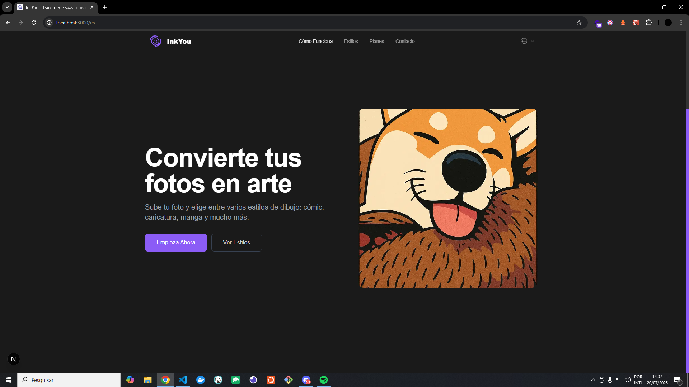
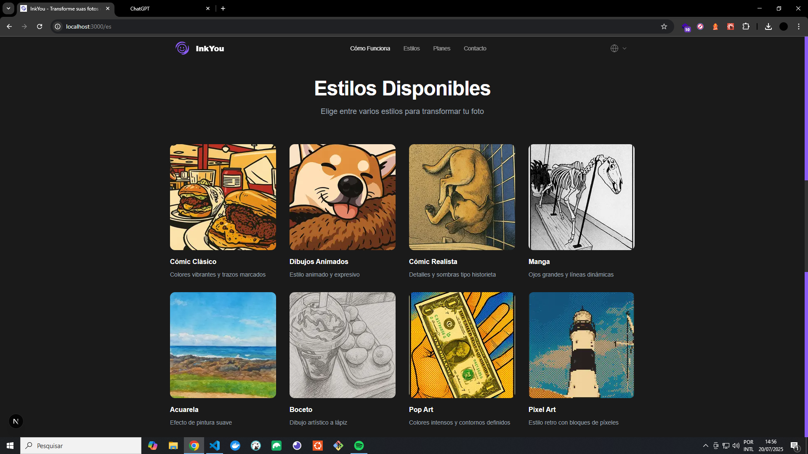
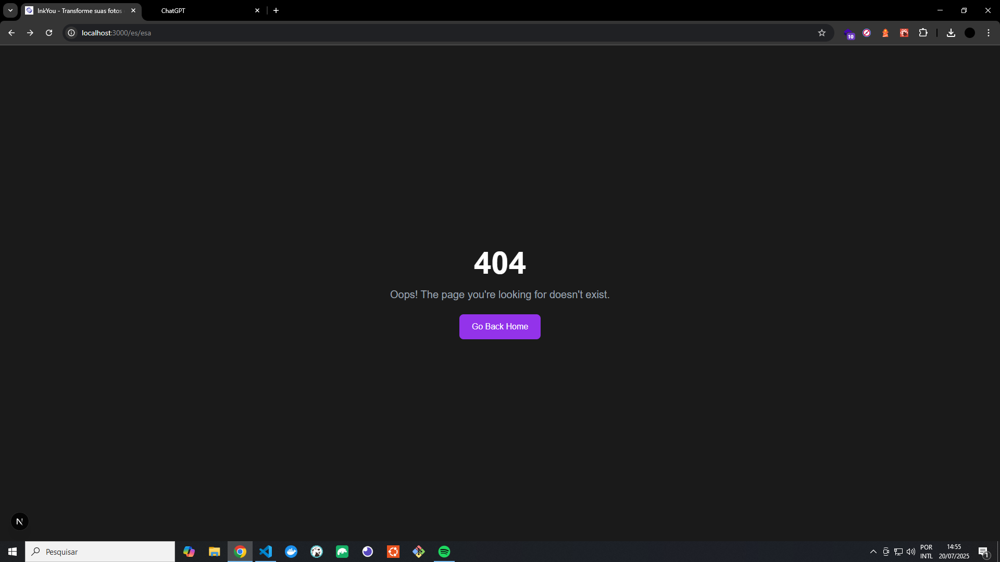

[](https://twitter.com/t_h_e_u)
[](https://www.linkedin.com/in/matheusgbatista/)
[](https://t-heu.github.io)

# InkYou 🎨


Transforme suas fotos e ideias em ilustrações incríveis com inteligência artificial.

## 📌 Sobre o projeto

**InkYou** é uma plataforma que converte imagens ou descrições em artes digitais estilizadas, com foco em cartoon, HQ, gibi, flat design e muito mais. Seja para criar um avatar, ícone de perfil, presente ilustrado ou simplesmente se divertir, o InkYou entrega resultados personalizados e prontos para compartilhar.

## 🖼️ Preview




### 🌟 Funcionalidades

- ✏️ Conversão de imagem em arte no estilo escolhido
- 🧠 Geração baseada em descrição de texto (prompt)
- 🎨 Estilos suportados: Cartoon, HQ, Gibi, Flat Design, Caricatura, Toon e outros
- 📱 Interface amigável, pensada para web e mobile
- 🔄 Opções de download em alta qualidade
- 💾 Histórico e galeria pessoal (futuramente)

## 🚀 Como usar

### Usuário final
Acesse a plataforma, escolha o estilo desejado, envie uma imagem ou escreva o que quer ilustrar, e aguarde o resultado.

### Desenvolvedores (modo local)

```bash
git clone https://github.com/seu-usuario/inkyou.git
cd inkyou
npm install
npm run dev
```
